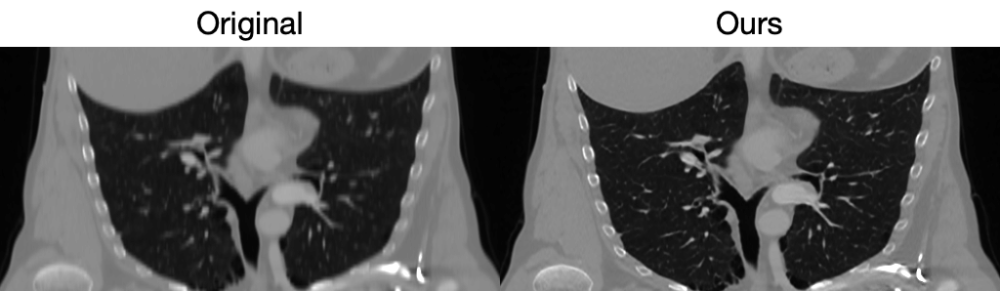
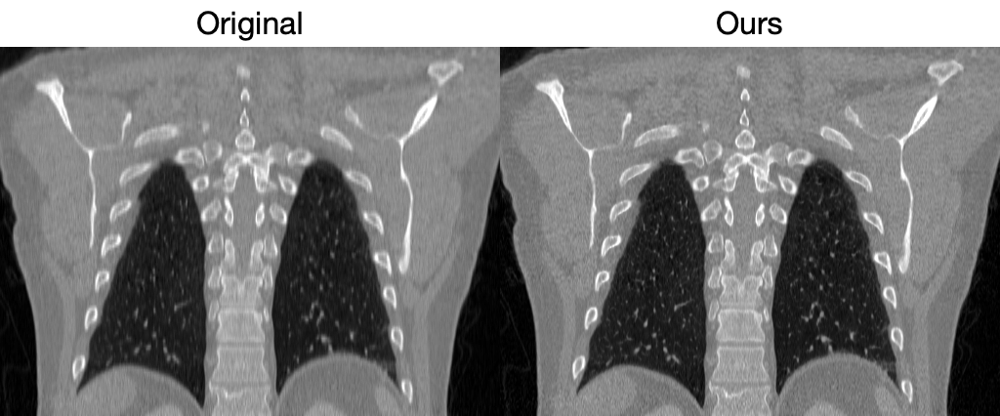

# SR4ZCT

This repository contains the code accompanying the paper:

**[SR4ZCT: Self-supervised Through-plane Resolution Enhancement for CT Images with Arbitrary Resolution and Overlap](https://link.springer.com/chapter/10.1007/978-3-031-45673-2_6)**

**[Self-supervised Resolution Enhancement for Anisotropic Volumes in Edge Illumination X-ray Phase Contrast Micro-Computed Tomography](https://www.sciencedirect.com/science/article/pii/S2949673X24000238)**

## Abstract
### SR4ZCT: Self-supervised Through-plane Resolution Enhancement for CT Images with Arbitrary Resolution and Overlap
Computed tomography (CT) is a widely used non-invasive medical imaging technique for disease diagnosis. The diagnostic accuracy is often affected by image resolution, which can be insufficient in practice. For medical CT images, the through-plane resolution is often worse than the in-plane resolution and there can be overlap between slices, causing difficulties in diagnoses. Self-supervised methods for through-plane resolution enhancement, which train on in-plane images and infer on through-plane images, have shown promise for both CT and MRI imaging. However, existing self-supervised methods either neglect overlap or can only handle specific cases with fixed combinations of resolution and overlap. To address these limitations, we propose a self-supervised method called SR4ZCT. It employs the same off-axis training approach while being capable of handling arbitrary combinations of resolution and overlap. Our method explicitly models the relationship between resolutions and voxel spacings of different planes to accurately simulate training images that match the original through-plane images. We highlight the significance of accurate modeling in self-supervised off-axis training and demonstrate the effectiveness of SR4ZCT using a real-world dataset.

### Self-supervised Resolution Enhancement for Anisotropic Volumes in Edge Illumination X-ray Phase Contrast Micro-Computed Tomography
X-ray phase contrast micro-computed tomography (micro-CT) can achieve higher contrast than conventional absorption-based X-ray micro-CT by utilizing refraction in addition to attenuation. In this work, we focus on a specific X-ray phase contrast technique, edge illumination (EI) micro-CT. EI uses a sample mask with transmitting apertures that split the X-ray beam into narrow beamlets, enabling detection of refraction-included intensity variations. Between the typical mask designs (circular and slit-shaped apertures), slit-shaped apertures offer practical advantages over circular ones, as they only require sample stepping in one direction, thereby reducing scanning time. However, this leads to anisotropic resolution, as the slit-shaped apertures enhances resolution only along the direction orthogonal to the slits. To address this limitation, we propose a self-supervised method that trains on high-resolution in-plane images to enhance resolution for out-of-plane images, effectively mitigating anisotropy. Our results on both simulated and real EI micro-CT datasets demonstrate the effectiveness of the proposed method.

## Prerequisites

- Ensure you have [Conda](https://docs.conda.io/en/latest/) installed.

## Installation

1. Clone this repository:
   ```bash
   git clone git@github.com:jiayangshi/SR4ZCT.git
   cd SR4ZCT
   ```

2. Create and activate a Conda environment:
    ```bash
    conda env create -f environment.yml
    conda activate sr4zct
    ```

## How to Use
This code includes example data from the [Low Dose CT Grand Challenge](https://www.aapm.org/grandchallenge/lowdosect/#trainingData). However, you're free to use your own data.

### Steps
1. **Data Preparation**: Generate training data based on the original resolution/overlap and target resolution/overlap. Also, prepare the test data.
    ```python
    python 0_prepare_volume.py
    ```

2. **Training and Testing**: Run the training and testing process. Intermediate results will be saved in the predefined directory *L291_result/* for monitoring the training progress. The enhanced resolution volumes will also be stored here.
    ```python
    python 1_train.py
    ```

## Results

We evaluated our method on both simulated and real-world CT images. Here are the example results:

### Simulated CT Images:
- **In-plane resolution**: 1mm, no overlap
- **Through-plane resolution**: 6.25mm with an overlap of 3.125 mm

   

### Real-world CT Images:
- **In-plane resolution**: 0.7421875 mm, no overlap
- **Through-plane resolution**: 3mm with an overlap of 1 mm

   


## Citation
If you find this work useful and use it in your research, please consider citing our paper:
```
@inproceedings{shi2023sr4zct,
  title={SR4ZCT: Self-supervised Through-Plane Resolution Enhancement for CT Images with Arbitrary Resolution and Overlap},
  author={Shi, Jiayang and Pelt, Dani{\"e}l M and Batenburg, K Joost},
  booktitle={International Workshop on Machine Learning in Medical Imaging},
  pages={52--61},
  year={2023},
  organization={Springer}
}

@article{shi2024self,
  title={Self-supervised Resolution Enhancement for Anisotropic Volumes in Edge Illumination X-ray Phase Contrast Micro-Computed Tomography},
  author={Shi, Jiayang and Brown, Louisa and Zekavat, Amir R and Pelt, Dani{\"e}l M and Hagen, Charlotte K},
  journal={Tomography of Materials and Structures},
  pages={100046},
  year={2024},
  publisher={Elsevier}
}
```
